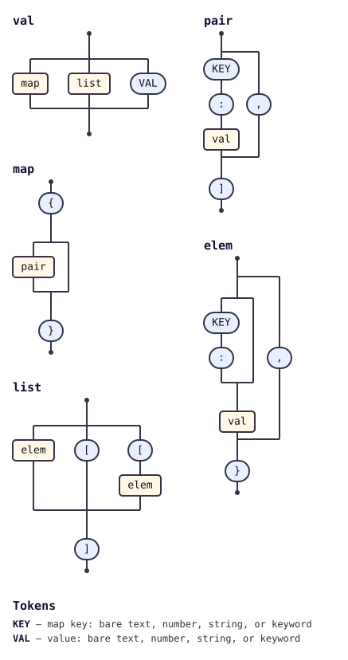

# @tabnas/json5

<!-- tabnas-badges -->
[](https://www.npmjs.com/package/@tabnas/json5)
[](https://github.com/tabnas/json5/actions/workflows/ci.yml)
[](https://pkg.go.dev/github.com/tabnas/json5/go)
[](https://tabnas.github.io/status/)
<!-- /tabnas-badges -->

A [Tabnas](https://github.com/tabnas/parser) /
[Jsonic](https://github.com/tabnas/jsonic) grammar plugin that parses
[JSON5](https://json5.org) — JSON plus comments, unquoted keys, trailing
commas, single quotes, hex / `Infinity` / `NaN` numbers, leading- and
trailing-decimal numbers, explicit `+` signs, and string line
continuations.

Both ports share one grammar file and are measured against the official
[`json5/json5-tests`](https://github.com/json5/json5-tests) corpus, which
is fetched at a pinned commit by `scripts/fetch-json5-tests.sh` (it is
never vendored into this repository).

**Conformance is not yet complete.** Measured 2026-08-07 against
json5-tests `ceb24d4`, asserting parsed VALUES and not merely
parse-vs-error, identically in TypeScript and Go:

| | TypeScript | Go |
|---|---|---|
| valid fixtures parsed with the correct value | 82 / 83 | 82 / 83 |
| invalid fixtures rejected | 31 / 31 | 31 / 31 |

Known gaps, both covered by currently-failing tests:

- `\uXXXX` escapes in an **unquoted** IdentifierName key are not decoded
  (the source `{ sig\u03A3ma: 1 }` yields the 11-character key
  `sig\u03A3ma` instead of the 6-character key `sigΣma`).
- Base-grammar **leniency leaks through**: an unterminated document is
  silently auto-closed (`{a:1` parses as `{a:1}`), and in TypeScript
  content after a complete top-level value is silently discarded
  (`{a:1} trailing` parses as `{a:1}`). Go rejects the latter.

## Install

```bash
# TypeScript / JavaScript
npm install @tabnas/parser @tabnas/jsonic @tabnas/json5

# Go
go get github.com/tabnas/json5/go@latest
```

## Example

**TypeScript**

```js
const { Tabnas } = require('@tabnas/parser')
const { jsonic } = require('@tabnas/jsonic')
const { Json5 } = require('@tabnas/json5')

const j = new Tabnas().use(jsonic).use(Json5)

j.parse('{ a: 1, b: [2, 3,], }')   // => { a: 1, b: [2, 3] }
```

**Go**

```go
import (
	tabnasjsonic "github.com/tabnas/jsonic/go"
	tabnasjson5 "github.com/tabnas/json5/go"
)

j := tabnasjsonic.Make()
j.UseDefaults(tabnasjson5.Json5, tabnasjson5.Defaults())
v, _ := j.Parse(`{ a: 1, b: [2, 3,], }`)
// v: map[string]any{"a": 1.0, "b": []any{2.0, 3.0}}
```

## Documentation

Full documentation follows the [Diátaxis](https://diataxis.fr) framework
— a tutorial to learn from, how-to recipes, a complete reference, and the
concepts behind it.

**TypeScript** — [`ts/doc/`](ts/doc/)

- [Tutorial](ts/doc/tutorial.md) · [How-to guide](ts/doc/guide.md) · [Reference](ts/doc/reference.md) · [Concepts](ts/doc/concepts.md)

**Go** — [`go/doc/`](go/doc/)

- [Tutorial](go/doc/tutorial.md) · [How-to guide](go/doc/guide.md) · [Reference](go/doc/reference.md) · [Concepts](go/doc/concepts.md)

## Grammar

The grammar is defined once in the top-level
[`json5-grammar.jsonic`](json5-grammar.jsonic) and embedded into both the
TypeScript ([`ts/src/json5.ts`](ts/src/json5.ts)) and Go
([`go/json5.go`](go/json5.go)) implementations by
[`ts/embed-grammar.js`](ts/embed-grammar.js), so the two ports stay in
sync.

As a railroad/syntax diagram, generated from the live grammar with
[`@tabnas/railroad`](https://github.com/tabnas/railroad):



An ASCII version is in [`ts/doc/grammar.txt`](ts/doc/grammar.txt).

## License

MIT. Copyright (c) 2021-2026 Richard Rodger and other contributors;
see [LICENSE](LICENSE).

The JSON5 conformance corpus is **not** redistributed by this project.
`scripts/fetch-json5-tests.sh` clones
[json5/json5-tests](https://github.com/json5/json5-tests) at a pinned
commit into `test/json5-tests/`, which is `.gitignore`d; that corpus is
MIT-licensed by its own authors (see `test/json5-tests/LICENSE.md` in the
fetched checkout).
