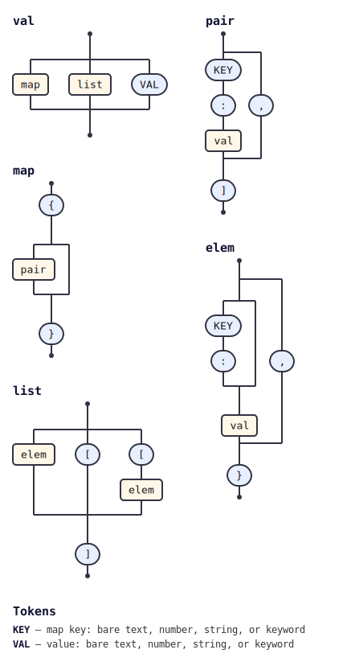

# @tabnas/json5

A [Tabnas](https://github.com/tabnas/parser) /
[Jsonic](https://github.com/tabnas/jsonic) grammar plugin that parses
[JSON5](https://json5.org) text into JavaScript values — with comments,
unquoted and single-quoted keys, single-quoted strings, trailing commas,
hexadecimal integers, `Infinity` / `NaN`, leading- and trailing-decimal
numbers, explicit `+` signs, and string line continuations.

Passes the full official
[`json5/json5-tests`](https://github.com/json5/json5-tests) corpus.

## Install

```bash
npm install @tabnas/parser @tabnas/jsonic @tabnas/json5
```

## Example

```js
const { Tabnas } = require('@tabnas/parser')
const { jsonic } = require('@tabnas/jsonic')
const { Json5 } = require('@tabnas/json5')

const j = new Tabnas().use(jsonic).use(Json5)

const src = `{
  // a JSON5 document
  name: 'Alice',
  tags: ['admin', 'user',],
}`

j.parse(src)   // => { name: 'Alice', tags: ['admin', 'user'] }
```

`jsonic` must be applied before `Json5`: it supplies the relaxed-JSON
rules the plugin constrains and extends.

## Documentation

Full documentation, following the [Diátaxis](https://diataxis.fr)
framework:

- [Tutorial](doc/tutorial.md) — learn the plugin from a guided first parse.
- [How-to guide](doc/guide.md) — task recipes (options, errors, strictness).
- [Reference](doc/reference.md) — the API, every option, and accepted syntax.
- [Concepts](doc/concepts.md) — how it builds JSON5 on the engine, and why.

## Grammar diagram

The installed grammar as a railroad/syntax diagram, generated with
[`@tabnas/railroad`](https://github.com/tabnas/railroad):



A vertical ASCII version is in [`doc/grammar.txt`](doc/grammar.txt). The
grammar source lives in the repository-root
[`json5-grammar.jsonic`](../json5-grammar.jsonic) and is embedded into
this port and the Go port by [`embed-grammar.js`](embed-grammar.js).

## License

Copyright (c) 2021-2026 Richard Rodger and other contributors,
[MIT License](LICENSE).
